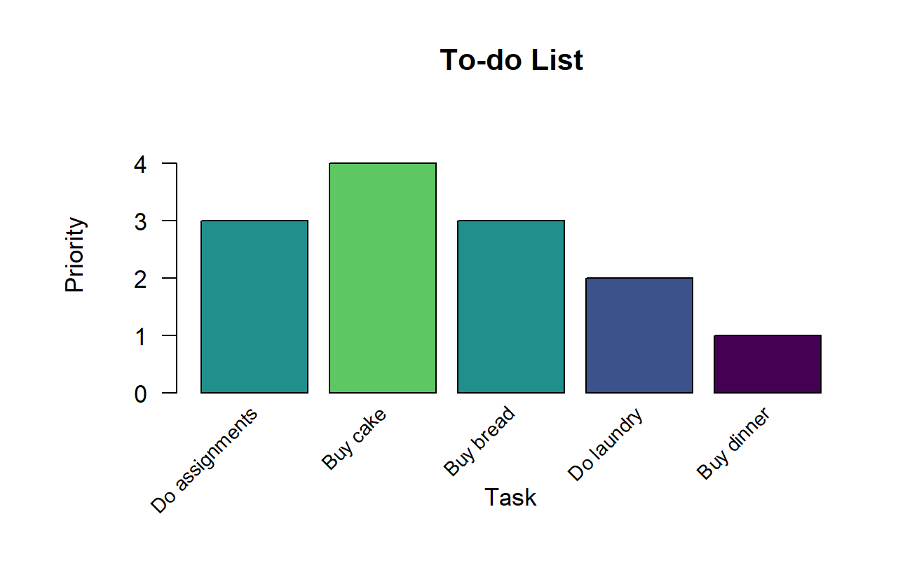
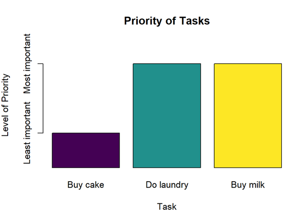
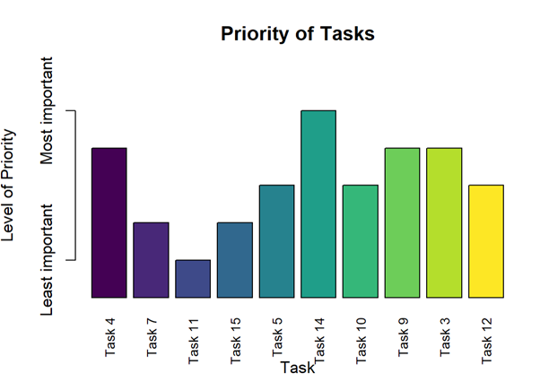

```{r, include = FALSE}
knitr::opts_chunk$set(
  collapse = TRUE,
  comment = "#>"
)
```

```{r setup, echo = FALSE, message = FALSE, warning = FALSE}
library(taskPlanner)
library(tidyverse)
library(knitr)
```

<br>

# Introduction

The `taskPlanner` package offers a comprehensive solution for effective task management, designed to streamline your daily workflow and enhance productivity. With a robust system for organizing to-do lists, `taskPlanner` provides tools for adding, removing, and updating items effortlessly. Whether you're a busy professional, a student juggling multiple assignments, or anyone seeking better organization in your daily life, `taskPlanner` equips you with the functionality needed to stay on top of your tasks with ease.


Explore the key features and functionalities of `taskPlanner` as we demonstrate how you can leverage its tools to optimize your task management process. From filtering tasks by date and priority to real-time task tracking, `taskPlanner` is your go-to solution for efficient task planning and execution.

<br>

# Installation & Getting Started

You can install the `taskPlanner` package from GitHub using the `devtools` package:

```r
devtools::install_github("Advanced-R-Programming/assignment-3-package-completion-agoh0008")
```

```r
library(taskPlanner)
```

<br>


# Import Current To-Do List 

To load the most recent to-do list, you can run the following command:

```r
list <- import_todo_list()
```

This first checks for the existence of the to-do list file within the `inst` directory of the `taskPlanner` package. If the file `todo_list.csv` exists, it is read into R as a data frame. 

<br>

If the to-do list file does not exist, an empty data frame is created with appropriate column headers ("task", "priority", "due"). This ensures that you always have a valid data structure to work with, even if you haven't yet created a to-do list or if the file has been accidentally deleted.

<br>

# Functions

The following functions provide users the capability to efficiently handle tasks, including adding, updating, and removing them, along with the ability to create S3 objects and perform real-time task tracking. Furthermore, features such as task filtering by date or priority, as well as sorting options, provide users with the flexibility needed to tailor their task management approach to their specific needs and preferences.

<br>

## Adding New Tasks 

To add new tasks to your to-do list, call the `add_task` function with the appropriate arguments: `todo_list`, `task`, `priority`, and `due.`

Make sure to provide valid inputs:

- `todo_list`: A data frame or list representing the current to-do list.
- `task`: A character string specifying the task to be added.
- `priority`: An integer specifying the priority of the task (1-5).
- `due`: A Date object specifying the due date of the task in "YYYY-MM-DD" format.

```r
list <- add_task(list, "Buy bread", 3, "2024-03-15")
list <- add_task(list, "Do laundry", 2, "2024-03-16")
list <- add_task(list, "Buy dinner", 1, "2025-01-09")
```

If the task is successfully added, the updated to-do list will be returned. If a similar task already exists in the list, a warning will be displayed, and the original list will be returned without any changes


```r
# Updated to-do list after adding tasks
print(list)

#>             task priority        due
#> 1 Do assignments        3 2024-03-15
#> 2       Buy cake        4 2024-03-16
#> 3      Buy bread        3 2024-03-15
#> 4     Do laundry        2 2024-03-16
#> 5     Buy dinner        1 2025-01-09
```

<br>

## Updating Tasks 

To update existing tasks in your to-do list, you can use the `update_task` function. Below is an example of how to update a task at index 3 with new values:

```r
list <- update_task(3, list, "Buy milk", 2, "2024-03-18")
```

In this example:

- `3` is the index of the task to be updated.
- `list` is the current to-do list data frame or list.
- `"Buy milk"` is the updated task description.
- `2` is the updated priority of the task.
- `"2024-03-18"` is the updated due date of the task.

Ensure that you provide valid inputs for the task index, new task description, priority, and due date. After executing the `update_task` function, the specified task in the to-do list will be updated with the new values.

```r
#>             task priority        due
#> 1 Do assignments        3 2024-03-15
#> 2       Buy cake        4 2024-03-16
#> 3       Buy milk        2 2024-03-18
#> 4     Do laundry        2 2024-03-16
#> 5     Buy dinner        1 2025-01-09
```

<br>

## Removing Tasks 

To remove tasks from your to-do list, you can utilize the `remove_task` function. Below is an example of how to remove a task at index 1 from the list: 

```r
list <- remove_task(1, list)
```

The parameters used are:

- `1` is the index of the task to be removed.
- `list` is the current to-do list data frame or list.


Ensure to provide a valid index for the task you want to remove. After executing the `remove_task` function, the specified task will be removed from the to-do list, and the list will be updated accordingly.

```r
print(list)
#>         task priority        due
#> 1   Buy cake        4 2024-03-16
#> 2   Buy milk        2 2024-03-18
#> 3 Do laundry        2 2024-03-16
#> 4 Buy dinner        1 2025-01-09
```

<br>

## Saving To-Do List

To save your current to-do list, you can use the `export_todo_list` function as follows:

```r
export_todo_list(list)
```

This exports the updated to-do list back to a CSV file named "todo_list.csv" located in the `inst` directory of your package. Ensure that you have provided the `todo_list` argument, which should be the to-do list data frame or list you want to export.

The next time you import the to-do list, it will be the version you saved in the current state.


<br>

# S3 Object & Generic Functions

<br>

## Creating an S3 Object

The `create_todo_list` function is designed to facilitate the creation of an S3 object representing a to-do list. It accepts a data frame containing tasks, priorities, and due dates as input. If no to-do list is provided, the function automatically imports the current to-do list file. 

The resulting object is then assigned the class "TodoList," making it a structured and organized representation of the tasks at hand. This function simplifies the process of managing and manipulating to-do lists within R, providing users with a streamlined approach to organizing their tasks efficiently.

- Creating a TodoList object from an existing to-do list data frame:

```r
my_todo_list <- create_todo_list(list)
```

- Creating a TodoList object from the current to-do list file (imported from package data):

```r
my_todo_list <- create_todo_list()
```

<br>

## Printing TodoList Object

The `print.TodoList` function is designed to print the tasks contained in a 'TodoList' object along with their priorities and due dates. It formats the output in a tabular format with columns for the task description, priority, and due date. 

This function is particularly useful for displaying the contents of 'TodoList' objects in a readable format.

Output:

```r
print(my_todo_list)
```

```r
Task		Priority	Due Date
------------------------------------------------------------
Do assignments       	       3 	2024-03-15 
Buy cake             	       4 	2024-03-16 
Buy bread            	       3 	2024-03-15 
Do laundry           	       2 	2024-03-16 
Buy dinner           	       1 	2025-01-09
```

<br>

## Plotting TodoList Object

The `plot.TodoList` function allows you to visualize the tasks in a 'TodoList' object by creating a bar plot. Each task is represented by a bar, with the height of the bar indicating its priority level. The function uses a color palette to distinguish between different priority levels, making it easier to identify high-priority tasks.

Output:

```r
plot(my_todo_list)
```

<p align="center">
  
</p>


<br>

## Filter & Show Items by Date 

The `show_items_by_date` function is a versatile tool for filtering and displaying items from a to-do list or other applicable classes based on a specified date criteria. It accepts an object of class 'TodoList' or other object types, along with a date parameter in the format "YYYY-MM-DD" to filter the items.

You can leverage this function to easily identify tasks due on a particular date. To demonstrate its usage, input your to-do list object, specify the desired date, and you will promptly receive a list of tasks due on that specific date. 

```r
show_items_by_date(my_todo_list, date = "2024-03-16")
```

Output (Object of 'TodoList' class):

```r
#> Filtered items:
#>         Task Priority   Due_Date
#> 1   Buy cake        4 2024-03-16
#> 2 Do laundry        2 2024-03-16
```

Or, if you have tasks stored in other classes, you can still use this function by providing the appropriate object and date filter:

```r
set.seed(123)
other_object <- list(
  task = paste("Task", 1:15),
  priority = sample(1:5, 15, replace = TRUE),
  due = sample(seq(as.Date("2022-01-01"), as.Date("2025-12-31"), by = "day"), 15)
)

show_items_by_date(other_object, date = "2024-10-13")
```

Output (Object of 'list' class):

```r
#> Filtered items:
#>     Task Priority   Due_Date
#> 1 Task 1        3 2024-10-13
```


<br>

## Filter & Show Items by Priority 

The `show_items_by_priority` function provides a convenient way to filter and display items from a to-do list or other applicable classes based on a specified priority filter criteria. Simply input the object containing your tasks and specify the priority level you want to filter by, ranging from 1 to 5.

For example, to display tasks with priority level 2 from a TodoList object:

```r
show_items_by_priority(my_todo_list, priority = 2)
```

Output (Object of 'TodoList' class):

```r
#> Filtered items:
#>         Task Priority   Due_Date
#> 1   Buy milk        2 2024-03-18
#> 2 Do laundry        2 2024-03-16
```

Or, if you have tasks stored in other classes, you can still use this function by providing the appropriate object and priority level:

```r
set.seed(123)
other_object <- list(
  task = paste("Task", 1:15),
  priority = sample(1:5, 15, replace = TRUE),
  due = sample(seq(as.Date("2022-01-01"), as.Date("2025-12-31"), by = "day"), 15)
)

show_items_by_priority(other_object, priority = 2)
```

Output (Object of 'list' class):

```r
#> Filtered items:
#>     Task Priority   Due_Date
#> 1 Task 3        2 2024-04-19
#> 2 Task 4        2 2022-01-26
#> 3 Task 9        2 2023-08-16
```

This function streamlines the process of organizing tasks based on priority, helping you focus on what task matters most.

<br>

## Show Items due Today or Earlier

For real-time task tracking, the `show_today` function provides an instant overview of tasks that are due today or earlier in your to-do list. This allows users to efficiently manage their daily tasks by focusing on immediate priorities. Additionally, the function generates a bar chart illustrating the priority of tasks, with higher priority tasks indicated by taller bars. 

To utilize this feature, simply call the function and pass your to-do list object as the argument.

```r
show_today(my_todo_list)
```

Output (Object of 'TodoList' class):

```r
#> Items due today or earlier:
#>        Task Priority   Due_Date
#>    Buy cake        4 2024-03-16
#>  Do laundry        2 2024-03-16
#>    Buy milk        2 2024-03-18
```

<p align="center">
  
</p>


If you have tasks stored in other classes, you can still use this function by passing your object as the argument:

```r
set.seed(123)
other_object <- list(
  task = paste("Task", 1:15),
  priority = sample(1:5, 15, replace = TRUE),
  due = sample(seq(as.Date("2022-01-01"), as.Date("2025-12-31"), by = "day"), 15)
)

show_today(other_object)
```

Output (Object of 'list' class):

```r
#> Items due today or earlier:
#>     Task Priority   Due_Date
#>   Task 4        2 2022-01-26
#>   Task 7        4 2022-07-30
#>  Task 11        5 2023-01-08
#>  Task 15        4 2023-05-05
#>   Task 5        3 2023-06-03
#>  Task 14        1 2023-06-28
#>  Task 10        3 2023-07-09
#>   Task 9        2 2023-08-16
#>   Task 3        2 2024-04-19
#>  Task 12        3 2024-04-23
```

<p align="center">
  
</p>

<br>


## Sort Items by Date or Priority

The `sort_items` function enables users to sort tasks based on either their due dates or priority levels. It accepts an object of class 'TodoList' or other applicable classes, along with parameters specifying whether to sort by date or priority level (with `date = TRUE` indicating sorting by date and `date = FALSE` indicating sorting by priority) as well as the sorting order (with `ascending = TRUE` indicating ascending order and `ascending = FALSE` indicating descending order).

### Sorting by Date

To sort items by their due dates, you can use the following syntax:

```r
sort_items(my_todo_list, date = TRUE, ascending = TRUE)
```

This will display the to-do list sorted by date in ascending order. 

Output for Sorting by Dates (Object of 'TodoList' class):


```r
#> Sorted To-Do List by date in ascending order:
#>        Task Priority   Due_Date
#>  Do laundry        2 2024-03-16
#>    Buy cake        4 2024-03-16
#>    Buy milk        2 2024-03-18
#>  Buy dinner        1 2025-01-09
```

### Sorting by Priority

To sort items by their priority levels, you can use the following syntax:

```r
set.seed(123)
other_object <- list(
  task = paste("Task", 1:15),
  priority = sample(1:5, 15, replace = TRUE),
  due = sample(seq(as.Date("2022-01-01"), as.Date("2025-12-31"), by = "day"), 15)
)
sort_items(other_object, date = FALSE, ascending = FALSE)
```

This will display the to-do list sorted by priority in descending order.

Output for Sorting by Priority (Object of 'list' class):


```r
#> Sorted To-Do List by priority in descending order:
#>     Task Priority   Due_Date
#>   Task 6        5 2025-12-20
#>  Task 11        5 2023-01-08
#>   Task 7        4 2022-07-30
#>  Task 15        4 2023-05-05
#>   Task 1        3 2024-10-13
#>   Task 2        3 2025-10-10
#>   Task 5        3 2023-06-03
#>  Task 10        3 2023-07-09
#>  Task 12        3 2024-04-23
#>  Task 13        3 2025-03-12
#>   Task 3        2 2024-04-19
#>   Task 4        2 2022-01-26
#>   Task 9        2 2023-08-16
#>   Task 8        1 2024-07-20
#>  Task 14        1 2023-06-28
```

<br>

# License

This package is licensed under the GPL License. See the LICENSE file for details.


